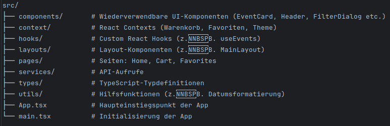

# Events App

# 📱 Projektübersicht
Die Events-App ist eine moderne, responsive Webanwendung zur Anzeige und Verwaltung von Veranstaltungen. 
Benutzer können Events durchsuchen, filtern, zu Favoriten hinzufügen und in den Warenkorb legen. 
Die Anwendung bietet eine intuitive Benutzeroberfläche mit Dark Mode und ist für alle Geräte optimiert.

# 📋 Aufgabenstellung und Anforderungen
[Frontend Task(events-app).pdf](../../../Downloads/Frontend%20Task%28events-app%29.pdf) HIER PDF REIN!!!
Diese App wurde als Teil einer Coding Challenge für Teclead Ventures entwickelt. Die Hauptanforderungen waren:

# Technische Anforderungen
1. Verwendung von REACT, Angular oder VueJs (implementiert mit React)
2. Ausschließliche Verwendung von TypeScript
3. Kein jQuery
4. Verwendung von SCSS für Styles (Less oder Sass waren vorgegeben)
5. Datenquelle: https://teclead-ventures.github.io/data/london-events.json
6. Eigenständige Analyse des API-Datenformats, da keine Dokumentation vorhanden

# Design-Anforderungen

1. Grobe Übereinstimmung mit dem bereitgestellten Design-Mock
2. Freie Wahl von Farben und Formen
3. Verwendung von UI-Bibliotheken erlaubt (implementiert mit Material UI)

# Repository-Anforderungen

1. Bereitstellung über GitHub oder GitLab
2. Repository-Name muss über UUID v4 generiert werden
3. README mit Startanweisungen

# 📁 Projektstruktur (vereinfacht)

# Funktionale Anforderungen

### ✅ Events nach Datum sortiert
### ✅ Datum bleibt beim Scrollen am oberen Rand sichtbar
### ✅ Klick auf "+" aktualisiert Warenkorb-Icon und markiert bereits ausgewählte Events, Option auf entfernen von Events aus Warenkorb
### ✅ Klick auf Warenkorb zeigt Übersicht aller hinzugefügten Events
### ✅ Klick auf Location öffnet Google Maps in neuem Tab
### ✅ Suchfeld filtert Events nach Titeln mit dem Suchbegriff

# Zusätzlich implementierte Features

 Favoriten-Funktion
 Dark Mode
 Responsive Design mit Burger-Menü
 Erweiterte Filterfunktionen
 Demo Checkout-Prozess
 Persistenz von Warenkorb und Favoriten

# ✨ Features

1. Event-Übersicht: Anzeige von Events, gruppiert nach Datum
2. Detaillierte Event-Karten: Mit Titel, Datum, Ort und Teilnehmerzahl
3. Suchfunktion: Filterung von Events nach Suchbegriffen
4. Erweiterte Filter: Nach Stadt, Veranstaltungsort und Datum
5. Favoriten: Speichern von Events als Favoriten
6. Warenkorb: Hinzufügen von Events zum Warenkorb und Demo Checkout-Prozess
7. Responsive Design: Optimiert für Desktop, Tablet und Mobile mit Burger-Menü
8. Dark Mode: Umschaltbarer heller und dunkler Modus
9. Persistenz: Speicherung von Favoriten und Warenkorb im localStorage

# 🛠️ Technologien

1. Frontend: React, TypeScript, Material UI
2. Styling: SCSS mit BEM-Methodologie
3. Routing: React Router
4. Zustandsmanagement: React Context API
5. API-Kommunikation: Axios
6. Bundler: Vite
7. Linting: ESLint

# 📋 Voraussetzungen

 Node.js (v16 oder höher)
 npm

# 🚀 Installation und Start

1. Repository klonen:
2. git clone git@github.com:FabriceMru/be6f6f91-7fcd-41e0-ac74-87c5d1d4834d.git
3. cd [UUID-v4]

Abhängigkeiten installieren:

4. npm install
5. npm run dev